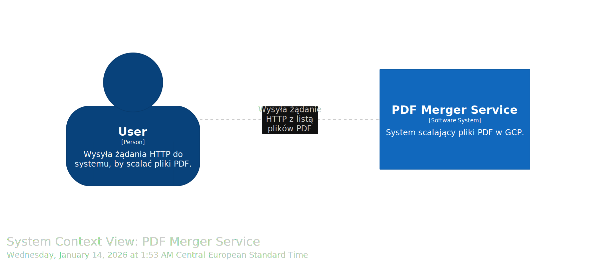
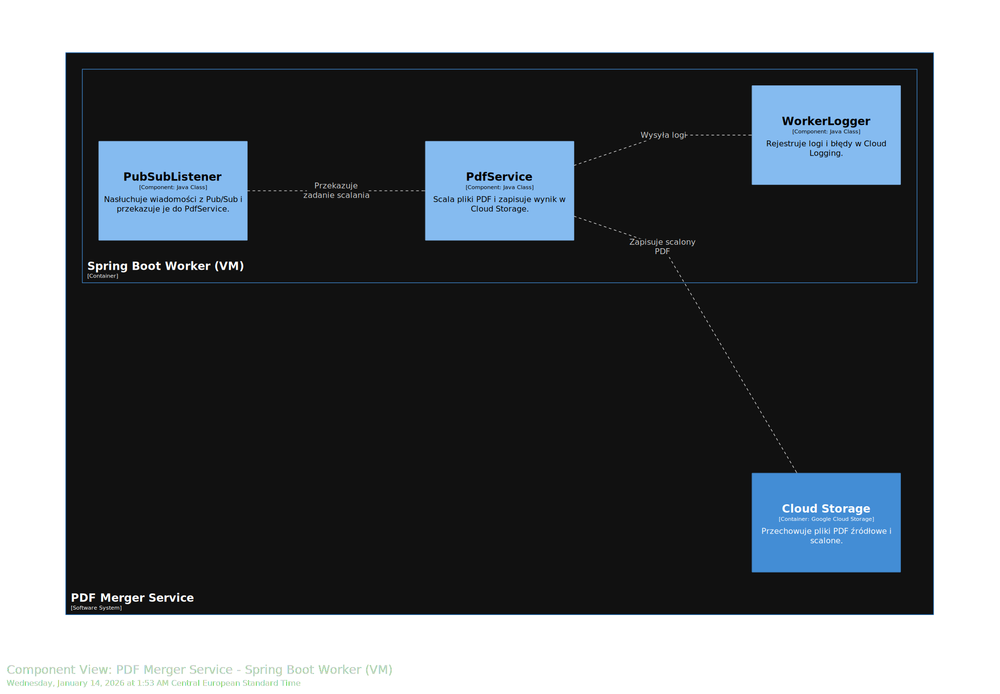

#  PDF Merger Service – Google Cloud Platform

## Opis projektu

**PDF Merger Service** to chmurowa aplikacja napisana w **Java + Spring Boot**, służąca do **łączenia wielu plików PDF w jeden dokument**.  
Projekt demonstruje wykorzystanie usług **Google Cloud Platform (GCP)** w architekturze opartej na komunikacji asynchronicznej przy użyciu **Pub/Sub**.

System składa się z dwóch głównych komponentów:
-  **Cloud Function (serverless)** – przyjmuje żądanie HTTP z listą plików PDF i umieszcza zadanie w kolejce Pub/Sub,
-  **Spring Boot Worker (Compute Engine VM)** – odbiera zadania z Pub/Sub, scala pliki PDF i zapisuje wynik w Google Cloud Storage.

##  Architektura systemu

Całość opisana jest w modelu **C4** przy użyciu **Structurizr DSL** na pozomie 3.

## Funkcjonalności

| Funkcjonalność | Opis | Usługa GCP |
|----------------|------|-------------|
| **Serverless API** | Przyjmuje żądanie HTTP z listą plików PDF do połączenia | Cloud Functions |
| **Kolejkowanie zadań** | Asynchroniczne przekazywanie zadań łączenia plików PDF |  Pub/Sub |
| **Przetwarzanie PDF** | Worker w Javie scala pliki PDF przy użyciu PDFBox |  Compute Engine VM |
| **Przechowywanie plików** | Przechowuje pliki źródłowe i wynikowe PDF |  Cloud Storage |
| **Monitorowanie i logi** | Rejestruje metryki i logi działania |  Cloud Logging & Monitoring |
| **Infrastructure as Code (IaC)** | Pełna infrastruktura zarządzana przez Terraform |  Terraform |

## Jak to ma działać

1. Użytkownik wysyła żądanie HTTP do Cloud Function
2. Cloud Function publikuje wiadomość Pub/Sub (`pdf-merge-topic`).
3. Worker (uruchomiony na VM) odbiera wiadomość, ściąga wskazane pliki z Cloud Storage, scala je i zapisuje wynikowy PDF.
4. Logi trafiają automatycznie do Cloud Logging, a stan zasobów monitorowany jest przez Cloud Monitoring.

##  Użyte technologie

**Backend:**
- Java 17
- Spring Boot 3.5.9
- Apache PDFBox
- Google Cloud SDK for Java (Pub/Sub, Storage)

**Infrastruktura:**
- Terraform
- GCP: Cloud Functions, Pub/Sub, Compute Engine, Cloud Storage, Logging